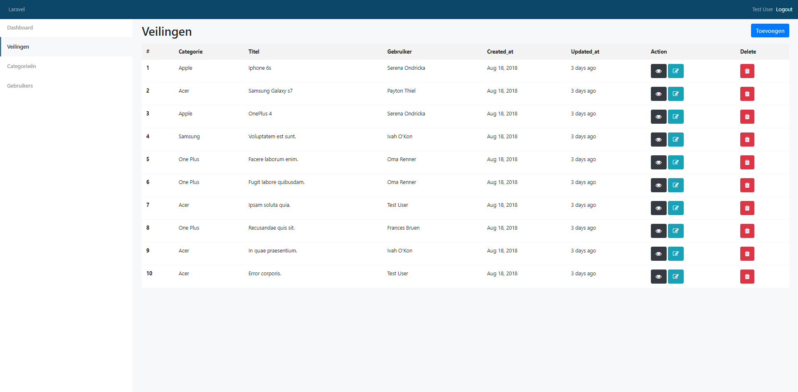
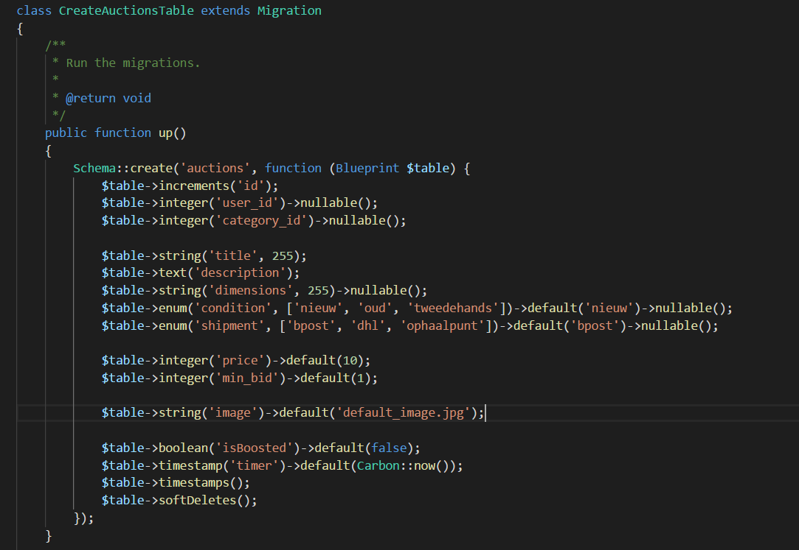
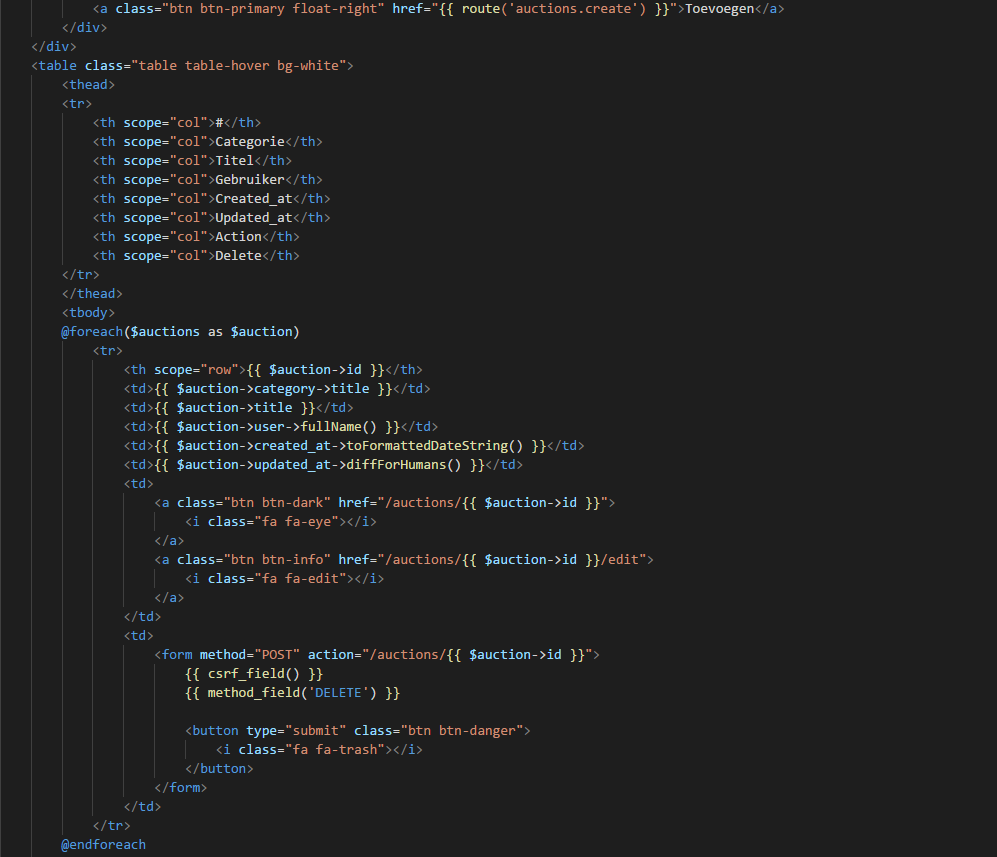
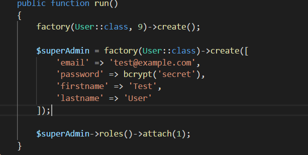
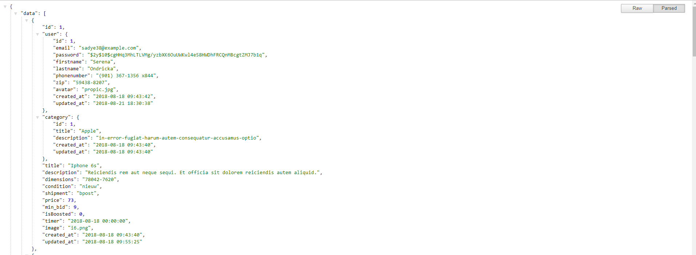
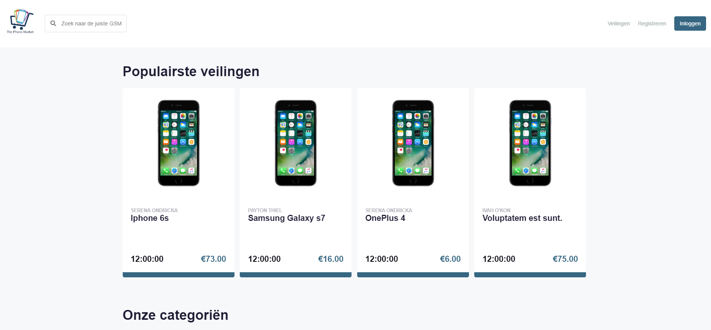
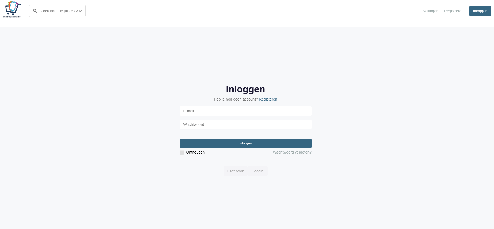
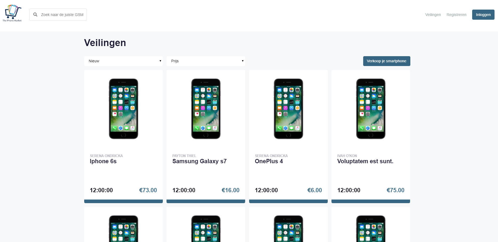
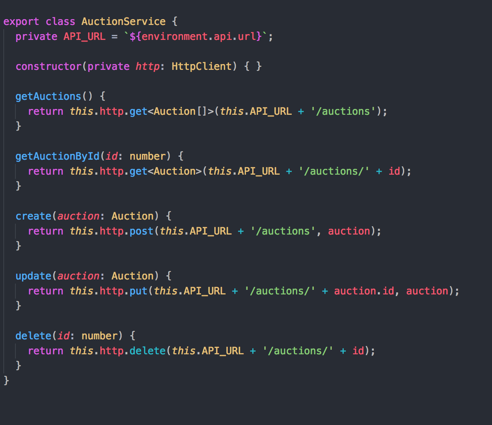
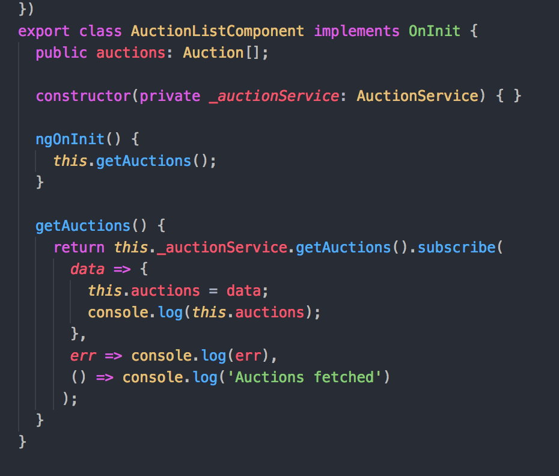

<section data-markdown>
    <textarea data-template>
        ## IV. Develop
    </textarea>
</section>

<section data-markdown>
    <textarea data-template>
        ### Backoffice (Laravel / REST API)
    </textarea>
</section>

<section data-markdown>
    <textarea data-template>
        
    </textarea>
</section>

<section data-markdown>
    <textarea data-template>
        
    </textarea>
</section>

<section data-markdown>
    <textarea data-template>
        
    </textarea>
</section>

<section data-markdown>
    <textarea data-template>
        
    </textarea>
</section>

<section data-markdown>
    <textarea data-template>
        
    </textarea>
</section>

<section data-markdown>
    <textarea data-template>
        
    </textarea>
</section>

<section data-markdown>
    <textarea data-template>
        ### Frontoffice (Angular)
    </textarea>
</section>

<section data-markdown>
    <textarea data-template>
        
    </textarea>
</section>

<section data-markdown>
    <textarea data-template>
        
    </textarea>
</section>

<section data-markdown>
    <textarea data-template>
        
    </textarea>
</section>

<section data-markdown>
    <textarea data-template>
        
    </textarea>
</section>

<section data-markdown>
    <textarea data-template>
        
    </textarea>
</section>